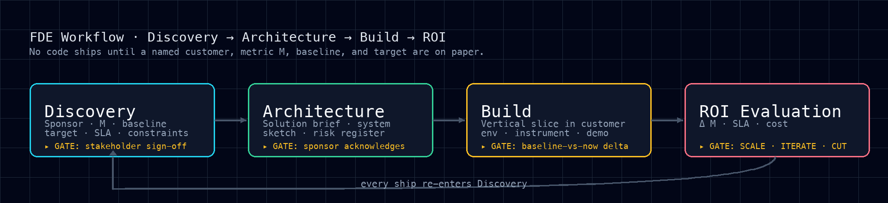
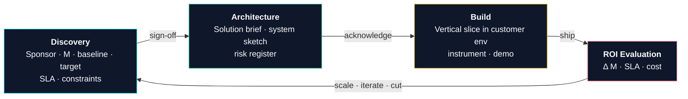
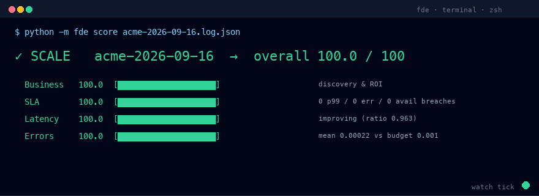

# FDE Skill Framework

> A production-grade **Forward Deployed Engineer (FDE)** skill for Hermes.
> Enforces a four-phase loop — **Discovery → Architecture → Build → ROI
> Evaluation** — with hard gates at each transition so engineering work
> always ties back to a named customer, a measurable business metric, and a
> contracted SLA.

<p align="center">
  
</p>

## Why this exists

An FDE ships working code into a customer environment that closes a
measurable business gap. Without a loop, FDE work drifts into one of three
failure modes: **hero-mode coding** (build first, justify later),
**demo-ware** (polished demos that collapse on real data), or **vanity
metrics** ("we process 1M events/day" with no business outcome behind it).
This framework refuses to write code until a named customer, a metric M, a
baseline, a target, and an SLA are on paper — and it scores the engagement
against those numbers after every ship.

## The loop, in one diagram



Every phase has an exit gate. **Build** never starts until **Discovery** is
signed. **ROI Evaluation** is appended to the engagement log after every
meaningful ship — not at the end. The four decision criteria are fixed and
shared with the sponsor before any code is written.

## The four-axis scorecard

The evaluator (`tests/test_fde_eval.py`) scores an engagement on four
weighted axes. The same function backs both the test harness and the CLI —
scores cannot drift between them.

| Axis              | Weight | What it catches                                              |
|-------------------|--------|--------------------------------------------------------------|
| **Business**      | 35%    | Was Discovery done? Are metric, baseline, target, ROI sourced? |
| **SLA compliance**| 30%    | p99 latency, error rate, availability vs contracted targets post-GA |
| **Latency trend** | 15%    | Is p99 stable or improving over the post-GA weeks?           |
| **API error rate**| 20%    | Mean error rate vs the customer's error budget               |

### Live demo

The `watch` subcommand re-scores on every file change. Here's a 6-second
loop showing three real scorecards from the bundled fixtures:

<p align="center">
  
</p>

What you just saw:

1. **SCALE 100/100** — `mrnavax-codonpair-v0.14.0-2026-09-16`. Discovery
   complete, zero SLA breaches, latency improving. Expand to next workflow.
2. **CUT 7.5/100** — `broken-2026-09-16` (legacy fixture). Discovery gaps
   (sponsor, metric, baseline, target, ROI all missing). Wind down cleanly,
   write up lessons, hand off what shipped.
3. **SCALE 96.4/100** — same engagement re-scored after week 5 of post-GA
   data. SLA score dropped slightly on a single availability breach, but
   decision holds. This is the `watch` loop in action — no JSON crafting,
   the file changes, the scorecard updates.

For the current dogfood set (mrnavax / globex / initech), see the
**Dogfood engagement** section below.

## What's in this repo

```
.
├── .hermes/
│   └── skills/
│       └── fde-workflow.md         # Canonical skill — single source of truth
├── .claude/
│   └── skills/
│       └── fde-workflow/SKILL.md   # Claude Code adapter (generated)
├── .cursor/
│   └── rules/
│       └── fde-workflow.mdc        # Cursor adapter (generated)
├── .clinerules/
│   └── fde-workflow.md             # Cline / Roo-Code adapter (generated)
├── .continue/
│   └── rules/
│       └── fde-workflow.md         # Continue.dev adapter (generated)
├── .opencode/
│   └── command/
│       └── fde-workflow.md         # OpenCode adapter (generated)
├── .github/
│   └── instructions/
│       └── fde-workflow.instructions.md   # Copilot adapter (generated)
├── .hermes.md                       # Project-wide business metrics, SLA defaults, tech stack contract
├── AGENTS.md                        # Codex CLI / generic adapter (generated)
├── fde/                             # CLI wrapper (stdlib only; zero install)
│   ├── __init__.py                  #   subcommands: score, init, log-week, watch
│   └── __main__.py                  #   entry point for `python -m fde`
├── references/
│   └── business-discovery-template.md  # Stakeholder interview template
├── scripts/
│   ├── build_adapters.py            # Regenerate all 8 adapters from the canonical skill
│   └── install_global.sh            # Copy adapters into ~/.claude, ~/.cursor, etc.
├── .devcontainer/
│   ├── devcontainer.json            # Codespace / VS Code devcontainer spec
│   └── postCreate.sh                # Runs on Codespace creation
├── tests/
│   ├── test_fde_eval.py            # Black-box evaluator (4 axes, weighted)
│   ├── test_cli.py                  # CLI smoke tests
│   ├── test_adapters.py             # Adapter frontmatter + drift tests
│   ├── test_properties.py           # Hypothesis property-based tests
│   └── test_importers.py            # Prometheus / Datadog / CSV importers
├── fde/importers/
│   ├── __init__.py                  # Importer registry
│   ├── prometheus.py                # Prom HTTP API JSON → engagement log
│   ├── datadog.py                   # Datadog metrics API JSON → engagement log
│   └── csv_import.py                # Ad-hoc CSV → engagement log
├── engagements/
│   ├── mrnavax-codonpair-v0.14.0-2026-09-16.{md,log.json}   # Dogfood SCALE
│   ├── globex-quote-turnaround-2026-09-16.{md,log.json}     # Dogfood ITERATE
│   └── initech-shadow-it-2026-09-16.{md,log.json}           # Dogfood CUT
├── docs/
│   ├── hero.png                     # This README's hero diagram (2x retina)
│   ├── hero.svg                     # Vector version for viewports that prefer SVG
│   └── fde-watch-demo.gif           # Animated terminal demo
└── README.md                        # This file
```

## Agent coverage

The framework ships adapter files for **eight** AI coding agents. The
canonical skill lives at `.hermes/skills/fde-workflow.md`; everything
else is generated from it by `scripts/build_adapters.py` so the rules
cannot drift between runtimes.

| Agent              | Loader path                                       | Format                  |
|--------------------|---------------------------------------------------|-------------------------|
| **Hermes**         | `.hermes/skills/fde-workflow.md`                  | YAML frontmatter + MD   |
| **Claude Code**    | `.claude/skills/fde-workflow/SKILL.md`            | YAML frontmatter + MD   |
| **Cursor**         | `.cursor/rules/fde-workflow.mdc`                  | `.mdc` (globs + MD)     |
| **Cline / Roo-Code** | `.clinerules/fde-workflow.md`                   | Plain markdown          |
| **GitHub Copilot** | `.github/instructions/fde-workflow.instructions.md` | `applyTo` frontmatter + MD |
| **Continue.dev**   | `.continue/rules/fde-workflow.md`                 | YAML frontmatter + MD   |
| **OpenCode**       | `.opencode/command/fde-workflow.md`               | YAML frontmatter + MD   |
| **Codex / generic**| `AGENTS.md`                                       | Plain markdown (auto-discovered) |

After editing the canonical skill, regenerate everything:

```bash
python scripts/build_adapters.py
python -m unittest tests.test_adapters    # validates frontmatter + drift
```

To install the FDE workflow as a **global rule** in every agent on this
machine:

```bash
bash scripts/install_global.sh
```

The global install re-builds and then copies the adapters into
`~/.claude/`, `~/.cursor/`, `~/.clinerules/`, `~/.continue/`,
`~/.opencode/`, and `~/.copilot/`. Hermes and Codex stay project-scoped
by design (Hermes loads per-repo config; `AGENTS.md` is committed to
the repo root).

## Metrics ingest (`fde import`)

Convert real monitoring exports into engagement logs so you don't have
to hand-craft JSON. Three sources supported; CLI signature is identical:

```bash
python -m fde import prometheus /path/to/prom-dump.json engagement.log.json
python -m fde import datadog    /path/to/dd-dump.json    engagement.log.json
python -m fde import csv        /path/to/metrics.csv     engagement.log.json
```

The importers write a skeleton with **blank Discovery fields** — sponsor,
metric M, baseline, target, and SLA are human decisions, not machine
outputs. After importing, edit the JSON to fill those in, then `fde score`.

Expected metric names per source:

| Source      | Names accepted                                            |
|-------------|------------------------------------------------------------|
| Prometheus  | `fde_p99_ms`, `fde_error_rate`, `fde_availability_pct`, `fde_metric_value` (prefix `fde_` required) |
| Datadog     | `fde.p99_ms`, `fde.error_rate`, `fde.availability_pct`, `fde.metric_value` |
| CSV         | header `week,p99_ms,error_rate,availability_pct,metric_value` (only `week` required) |

Samples are bucketed by ISO week before aggregation.

## Dogfood engagement

The repo ships **three** real engagement files (dogfood) covering all
three decision branches:

| Engagement                          | Decision | Scenario                                                            |
|-------------------------------------|----------|---------------------------------------------------------------------|
| `mrnavax-codonpair-v0.14.0`         | SCALE    | Per-tissue codon-pair scoring — Discovery clean, ROI 10.8×         |
| `globex-quote-turnaround`           | ITERATE  | Salesforce-CPQ-backed quoting — direction right, SLA missed every week |
| `initech-shadow-it`                 | CUT      | Endpoint threat detection — sponsor overrode FDE lead, Shadow IT realized |

All three walk the full Discovery → Architecture → Build → ROI loop
end-to-end with sourced numbers and a post-GA ROI evaluation:

```bash
# Score any of the three
python -m fde score engagements/mrnavax-codonpair-v0.14.0-2026-09-16.log.json
python -m fde score engagements/globex-quote-turnaround-2026-09-16.log.json
python -m fde score engagements/initech-shadow-it-2026-09-16.log.json
```

The mrnavax engagement scores 100/100 → **SCALE**, the globex engagement
scores ~79/100 → **ITERATE**, and the initech engagement scores ~24/100
→ **CUT** — each matching its in-file decision. If the harness ever
disagrees with an in-file decision, that's a framework bug — file an
issue.

The test suite (`tests/test_fde_eval.py`) loads these same engagement
files as its `GOOD_RUN`, `BAD_RUN`, and `ITERATE_RUN` fixtures, so the
scoring harness can't drift from the dogfood docs.

## Quickstart (Codespace / devcontainer)

One-click environment with everything pre-loaded:

```bash
gh codespace create --repo rollroyces/fde-skill-framework
```

The `postCreate.sh` regenerates adapters, installs `hypothesis` for
property tests, and runs the full suite as a smoke check. You land in
a terminal ready for `python -m fde --help`.

For local dev containers (Docker Desktop + VS Code "Reopen in
Container"), the `.devcontainer/devcontainer.json` does the same.

## Install into Hermes

The skill auto-loads from `.hermes/skills/` and the project config from
`.hermes.md` when you're in this repo. Two install options:

### A. Per-repo install (recommended)

Already in place at the right paths. From the Hermes desktop app or CLI:

```bash
hermes skills list
# You should see: fde-workflow

hermes status
# Should print the metrics from .hermes.md
```

### B. Global install

```bash
mkdir -p ~/.hermes/skills
cp .hermes/skills/fde-workflow.md ~/.hermes/skills/
cp -r references ~/                              # global discovery template
```

> **Note.** The per-repo version is preferred — `.hermes.md` and the
> references are project-specific (your SLA targets, your constraints).
> The skill file (`fde-workflow.md`) is generic and safe to globalize.

## Use the loop

In any Hermes session in this project:

```
/skill fde-workflow
```

Hermes will refuse to write code until the Discovery gate is met. Follow
the checklist:

1. Open `references/business-discovery-template.md` and fill it out **with**
   the sponsor. Don't paraphrase, don't guess — "TBD" is a blocker.
2. Once signed, copy the Discovery block into
   `engagements/<customer>-<date>.md`.
3. Draft the 1-page solution brief, send it to the sponsor before code.
4. Build a vertical slice in the customer's environment first. No mocks
   across the trust boundary.
5. Run ROI scoring via the harness after every meaningful ship.

## Use the CLI

The CLI wraps the same `evaluate()` function the pytest suite asserts
against, so scores cannot drift between the two surfaces.

```bash
# Scaffold a new engagement file (markdown + starter log)
python -m fde init globex --date 2026-09-16 --dir engagements/

# Append weekly measurements (interactive prompts)
python -m fde log-week engagements/globex-2026-09-16.log.json

# Score it
python -m fde score engagements/globex-2026-09-16.log.json
# →  ✓ SCALE   globex-2026-09-16  →  overall 87.3 / 100
#    Business  100.0  [████████████████████]  discovery & ROI
#    SLA        90.0  [██████████████████··]  0 p99 / 0 err / 1 avail breaches
#    ...

# CI-friendly one-shot: exit non-zero if decision is `cut`
python -m fde watch engagements/globex-2026-09-16.log.json --once --strict

# Live dashboard: re-score on every save
python -m fde watch engagements/globex-2026-09-16.log.json --interval 1.0

# WHY did this engagement score what it did? Names missing Discovery
# fields, the specific weeks that breached SLA, and ends every section
# with a concrete next action. Exits 0 if healthy, 1 if actionable, 2
# if the file is unreadable.
python -m fde doctor engagements/globex-2026-09-16.log.json
# ->  v SCALE   globex-2026-09-16  ->  overall 100.0 / 100
#
#    Discovery: complete (no missing fields).
#      -> next: keep Discovery fresh -- re-check on every scope change.
#
#    SLA: 0 breaches across 8 weeks (p99 mean 501ms vs target 2000ms).
#      -> next: keep watching; any single breach drops the SLA score.
#
#    Latency: trending stable (ratio second/first = 1.000).
#      -> next: no action; keep logging.
#
#    Errors: mean 0.00085 vs budget 0.005 across 8 weeks.
#      -> next: no action; error rate is within budget.
#
#    Decision: SCALE (overall 100.0, business 100.0).
#      -> next: expand to the next workflow / customer.
```

## Run the tests

```bash
# Run the bundled fixtures (smoke test + sample output)
python tests/test_fde_eval.py

# Run the full unittest suite (harness + CLI wrapper)
python -m unittest discover -s tests -v

# Score a real engagement log
python -m fde score path/to/engagement.json
```

Expected JSON shape for an engagement log is documented at the top of
`tests/test_fde_eval.py`.

### Decision rule

- **Scale** (overall ≥ 85, business ≥ 90): hit the target, ROI positive →
  expand.
- **Iterate** (50 ≤ overall < 85, business ≥ 60): hit direction, miss
  number → one bounded iteration.
- **Cut** (overall < 50, or business < 60): ROI negative or blocked →
  wind down cleanly.

## Tech stack contract

Hard constraints, fully detailed in `.hermes.md`. Headlines:

- **Languages.** Python 3.11+ or TypeScript 5+. Bash only for build/test
  glue (<200 lines, no business logic).
- **Frameworks.** FastAPI / Express / React. No new framework introductions
  inside an engagement without sponsor sign-off.
- **Data.** Customer data never leaves the customer's cloud or agreed
  region. PII tagged at ingest; downstream services refuse untagged data.
- **Secrets.** Customer's KMS / Vault only. No long-lived static creds.
  Service accounts scoped, rotated ≤90d.
- **Observability.** OpenTelemetry + Prometheus baseline. Every
  customer-facing endpoint emits request id, customer id, latency, result,
  error class.
- **Vendors.** Every external API needs a documented vendor SLA, a
  data-processing agreement, and a tested circuit breaker — *before* the
  first call.

## Anti-patterns the framework blocks

- **Hero-mode coding** — building before metric, baseline, SLA exist.
- **Demo-ware** — polished demos against sanitized toy data that collapse
  on the customer's real data.
- **Shadow IT** — deploying into the customer's cloud without their
  security reviewer's written approval.
- **Vanity metrics** — "we process 1M events/day" with no business
  outcome behind it.
- **Promising ROI you can't measure** — if you can't draw the
  measurement pipeline, don't put a number in the slide.

Full list in `.hermes/skills/fde-workflow.md` § Anti-patterns.

## Contributing

Changes that loosen a gate, soften an anti-pattern, or remove a hard
constraint need:

1. A one-paragraph rationale in the PR description.
2. Sign-off from at least one FDE lead.
3. An updated `.hermes.md` if business metrics or SLA targets shift.

## License

Internal use. Adapt the framework to your engagement model before sharing
externally.